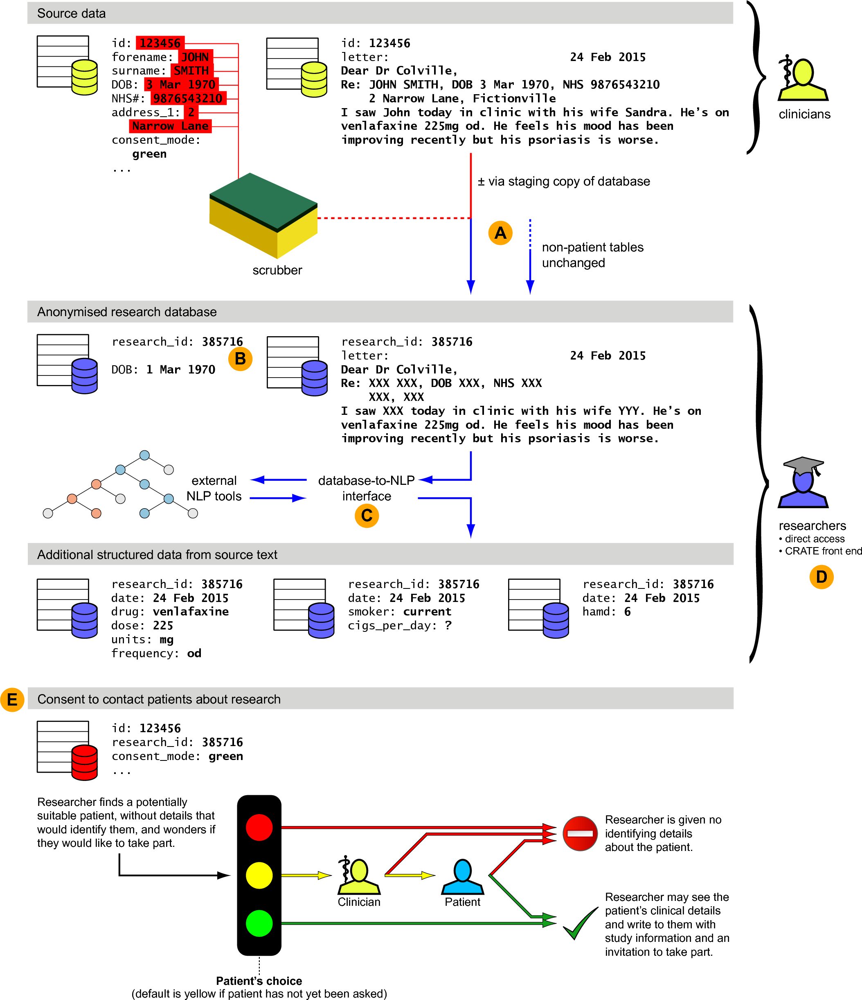

.. crate_anon/docs/source/introduction/overview.rst

..  Copyright (C) 2015-2020 Rudolf Cardinal (rudolf@pobox.com).
    .
    This file is part of CRATE.
    .
    CRATE is free software: you can redistribute it and/or modify
    it under the terms of the GNU General Public License as published by
    the Free Software Foundation, either version 3 of the License, or
    (at your option) any later version.
    .
    CRATE is distributed in the hope that it will be useful,
    but WITHOUT ANY WARRANTY; without even the implied warranty of
    MERCHANTABILITY or FITNESS FOR A PARTICULAR PURPOSE. See the
    GNU General Public License for more details.
    .
    You should have received a copy of the GNU General Public License
    along with CRATE. If not, see <http://www.gnu.org/licenses/>.

.. _overview:

Overview
========

A description is provided in Cardinal (2017) “Clinical records anonymisation
and text extraction (CRATE): an open-source software system”, BMC Medical
Informatics and Decision Making 17: 50; PubMed ID 28441940;
http://doi.org/10.1186/s12911-017-0437-1.

    Overview of the roles that CRATE can play in the creation of a research
    database. The figure shows a schematic of a full EMR containing sensitive
    and identifiable information, its processing into a pseudonymised research
    database, and methods through which researchers may use the research
    database to contact patients about research, while preserving anonymity for
    those who have not consented to be contacted. Key functions of CRATE are
    shown, as follows. **(A)** Anonymisation of source data in a relational
    database framework, using identifiers in the source data to ‘scrub’ free
    text. In this example the date of birth has also been partially obscured.
    **(B)** Generation of crypographically secure research IDs using hashed
    message authentication codes and one-time pads. An integer transient
    research ID is illustrated; full research IDs use longer hexadecimal
    digests. **(C)** Provision of a managed relational database interface to
    natural language processing tools such as GATE. **(D)** Provision of an
    optional web front end to a research database. **(E)** Management of a
    consent-to-contact process. The anonymisation, NLP, front end, and
    consent-to-contact components are modular and usable separately.

