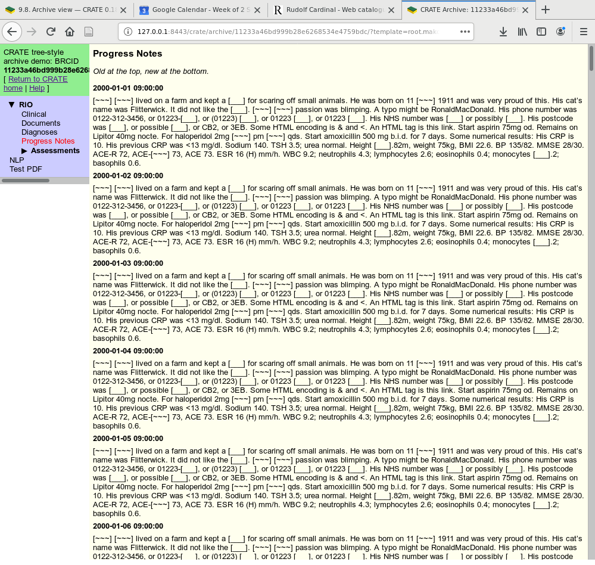
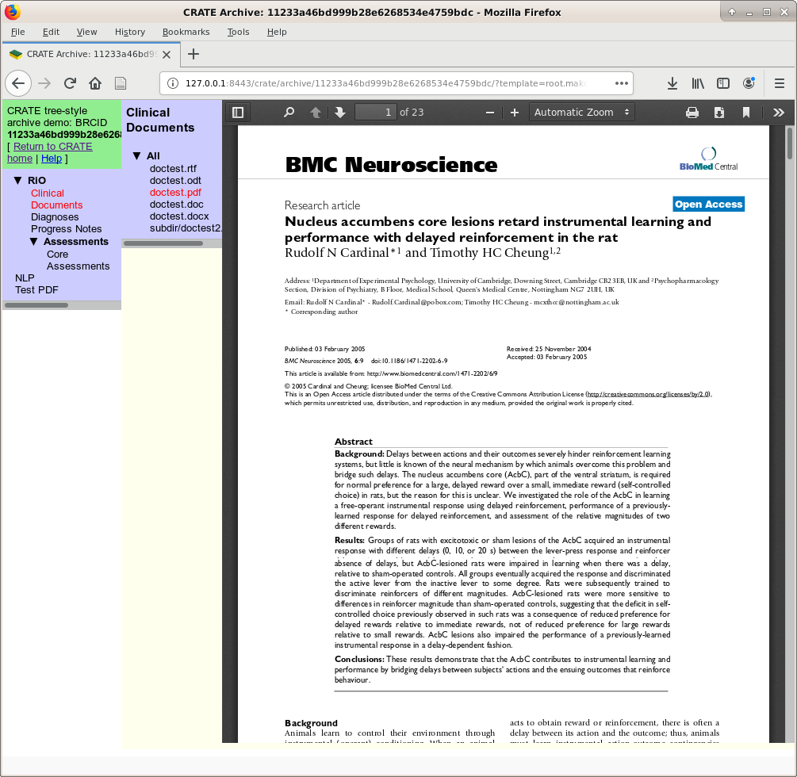
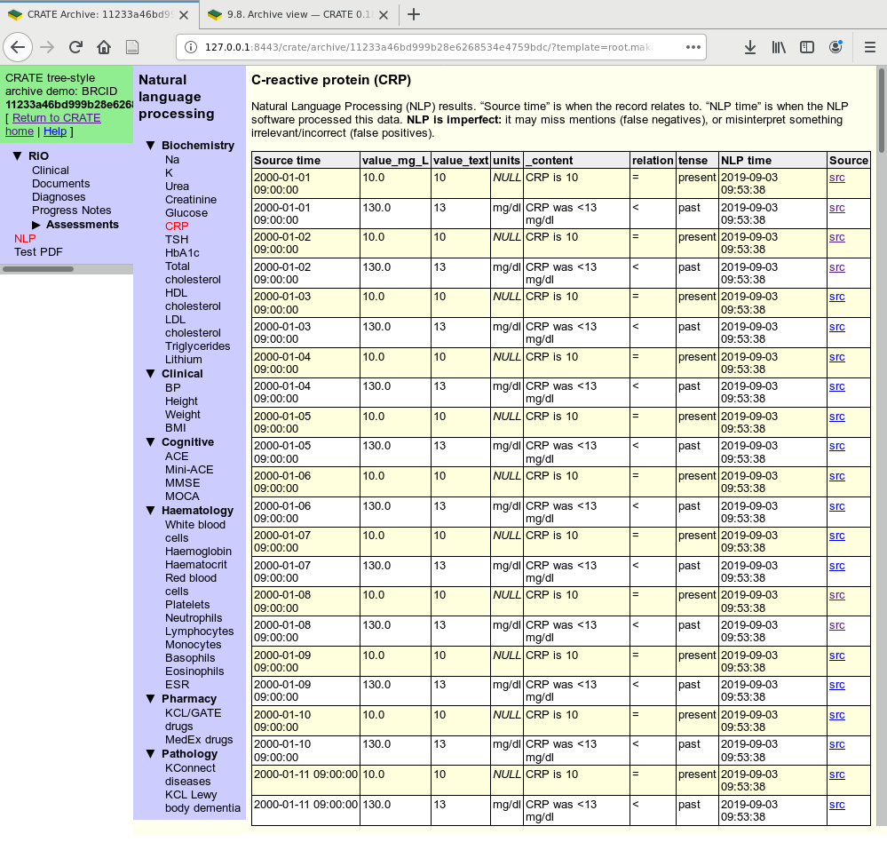
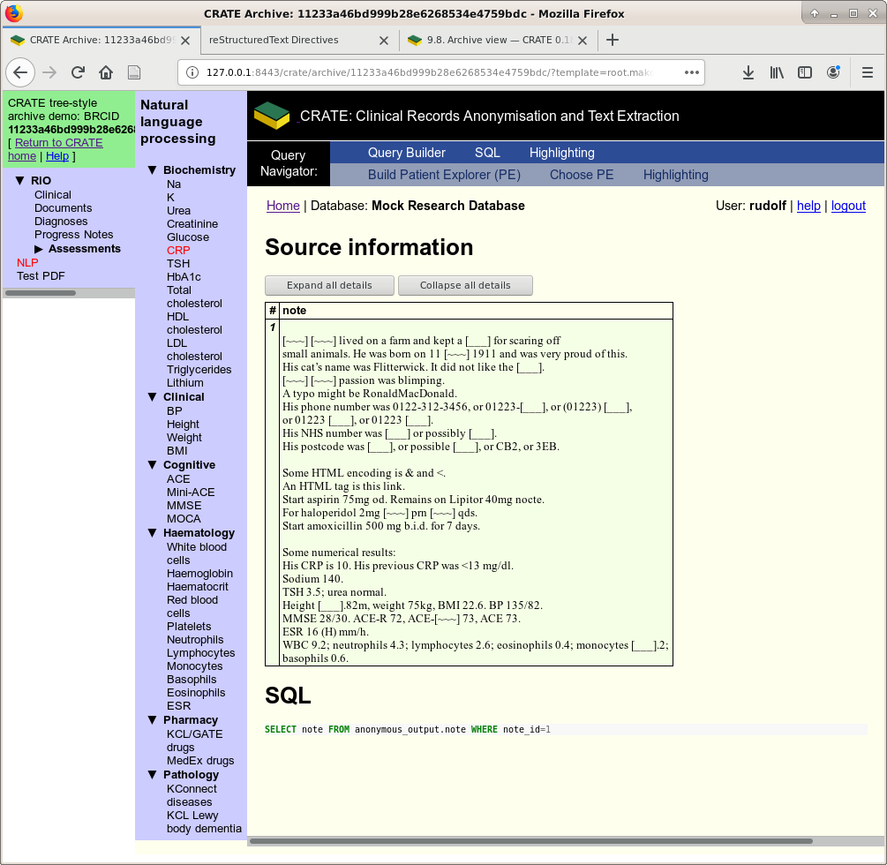

.. crate_anon/docs/source/website_using/archive.rst

..  Copyright (C) 2015-2019 Rudolf Cardinal (rudolf@pobox.com).
    .
    This file is part of CRATE.
    .
    CRATE is free software: you can redistribute it and/or modify
    it under the terms of the GNU General Public License as published by
    the Free Software Foundation, either version 3 of the License, or
    (at your option) any later version.
    .
    CRATE is distributed in the hope that it will be useful,
    but WITHOUT ANY WARRANTY; without even the implied warranty of
    MERCHANTABILITY or FITNESS FOR A PARTICULAR PURPOSE. See the
    GNU General Public License for more details.
    .
    You should have received a copy of the GNU General Public License
    along with CRATE. If not, see <http://www.gnu.org/licenses/>.

.. _CamCOPS: https://camcops.readthedocs.io/
.. _Django: https://docs.djangoproject.com/
.. _Django-Mako-Plus: http://doconix.github.io/django-mako-plus/index.html;
.. _Mako: https://www.makotemplates.org/
.. _Mako Runtime Environment: https://docs.makotemplates.org/en/latest/runtime.html
.. _Other template engines: https://wiki.python.org/moin/Templating#Templating_Engines

.. _archive:

Archive view
------------

Background
~~~~~~~~~~

This view provides an "archive" (read-only) view of an electronic health record
(EHR). It has two potential purposes:

- to provide a useful, configurable way in which researchers can explore the
  anonymised EHR of a single patient;

- to act as an archive view onto an identifiable EHR, if so configured.

It is *entirely* configurable by the local system administrators, though CRATE
comes with some specimen archive views.

How to customize the archive view
~~~~~~~~~~~~~~~~~~~~~~~~~~~~~~~~~

Write your archive
##################

Within a directory tree of your choice, write Mako_ templates. Some specimen
miniature web sites are provided to show you how, in:

.. code-block:: none

    crate_anon/crateweb/specimen_archives/basic/
    crate_anon/crateweb/specimen_archives/tree/

The "basic" one demonstrates basic layout, SQL queries, and downloading of
binary attachments. The "tree" one uses a collapsible tree-style menu on the
left and a range of specimen views onto the EHR on the right.

This system gives you full use of HTML/Javascript and Python simultaneously.
(Python code will run within the same interpreter and virtual environment used
by CRATE.)

.. _archive_mako_context:

The archive's Python context
############################

Mako templates have a context, which is a collection of Python objects
"visible" to template code (see `Mako Runtime Environment`_). In the CRATE
archive, this context is built up as follows:

#.  The config file's :ref:`ARCHIVE_CONTEXT <ARCHIVE_CONTEXT>` dictionary is
    shallow-copied with :func:`copy.copy`. You can use :ref:`ARCHIVE_CONTEXT
    <ARCHIVE_CONTEXT>` to pass a set of custom variables to your templates.

#.  That copy is updated with a specific set of keys, described next, which
    become visible as Python objects. (Doing it in this order means that
    ARCHIVE_CONTEXT can't override the special CRATE keys.)

#.  Mako will later add a few special objects of its own (see `Mako Runtime
    Environment`_).

The special objects provided by CRATE are:

- ``CRATE_HOME_URL``:

  URL to your site's CRATE home page. Use this to escape from the archive view!

- ``execute``:

  Function to run an SQL query (via the research database connection), or just
  execute raw SQL, and return a database cursor. Call it as

  .. code-block:: python

    cursor = execute(sql)
    cursor = execute(sql, args)

  Use question marks (``?``) in the SQL as argument placeholders.

- ``get_attachment_url``:

  Function to generate a URL to a binary attachment. This function
  adds the referring patient ID (for audit purposes) and calls
  :func:`crate_anon.crateweb.research.views.archive_attachment_url` (see that
  for details). Call it like this:

  .. code-block:: python

    get_attachment_url(filename, ...)

- ``get_static_url``:

  Function to generate a URL to a binary attachment, which is
  :func:`crate_anon.crateweb.research.views.archive_static_url` (see that
  for details). Call it like this:

  .. code-block:: python

    get_static_url(filename, ...)

- ``get_template_url``:

  Function to generate a URL to a template in another part of the archive, for
  the same patient. Call it as

  .. code-block:: python

    get_template_url(template_name, **kwargs)

  You can pass any keyword parameters except:

  - ``patient_id``
  - ``template``
  - ``mtime``

  (see :class:`crate_anon.crateweb.config.constants.UrlKeys`).

- ``patient_id``:

  The ID of this patient. (A string, but that will still work an an SQL
  parameter for integer fields. You can of course process it further if you
  wish.)

- ``query_params``:

  The HTTP GET query parameters, as a Django
  :class:`django.http.request.QueryDict`.

- ``request``:

  The Django HTTP request, a :class:`django.http.request.HttpRequest` object.

These objects are directly accessible, e.g. as ``${patient_id}``, in Mako
statements. In the more obvious Python blocks (e.g. within Mako's ``<% ... %>``
blocks), they are also accessible, as (in this example) any of ``patient_id``,
``context["patient_id"]``, or ``context[ArchiveContextKeys.patient_id]``.

One use for :ref:`ARCHIVE_CONTEXT <ARCHIVE_CONTEXT>` is to develop a set of
templates that operate either with an original identified clinical records
database or with a de-identified version with slightly different structure (but
similar enough to want to avoid code redundancy). You could set a flag in
:ref:`ARCHIVE_CONTEXT <ARCHIVE_CONTEXT>` to tell your templates which one is
currently in use.

Point CRATE at your archive
###########################

See the relevant section of the :ref:`web config file <webconfig_archive>`.

Examples
~~~~~~~~

Here's part of the demonstration tree-style archive, with entirely fictional
data (and de-identified to boot).

    "Progress Notes" display. The template has fetched data for the current
    patient via an SQL query and reformatted it to look like a conventional EHR
    "progress notes" journal (though in this case without author information).

    "Clinical Documents" display, showing PDFs inline.

    View on a NLP table, created by CRATE through analysis of free text. A
    generic "query results" template is used.

    The NLP results hyperlink through to their source data, if available.
    Here's the note that generated one of the CRP values.

.. figure:: screenshots/archive_nlp_kcl_drugs.png

    Another NLP view, this time of drugs found via the :ref:`KCL GATE
    pharmacotherapy <kcl_pharmacotherapy>` app.

Design notes
~~~~~~~~~~~~

2019-08-31:

- HTML templates, written locally, stored on disk in a user-defined directory.

  - Any template engine would be reasonable, but the two obvious candidates are

    - Django_, because we use that for the CRATE web front end (but the
      template language is somewhat restricted);
    - Mako_, because the templates can include arbitrary Python, and because
      Django/Mako interoperability is possible (including via
      Django-Mako-Plus_ but also directly).
    - `Other template engines`_, but nothing is particularly compelling over
      those two.

    Let's use Mako.

- A structure that is configurable by the local administrator (stored in a
  config file, a database, or on disk), mapping the templates.

  The best is probably to specify a single template as the root template in
  the config file.

- A URL system to produce requests to other parts of the archive, with
  arbitrary parameters via HTTP GET URL parameters.

- Pre-population of the template dictionary with useful objects (but not those
  that take much time to create). See
  :func:`crate_anon.crateweb.research.views.archive_template`.

.. todo:: archive: consider Windows authentication to Django
